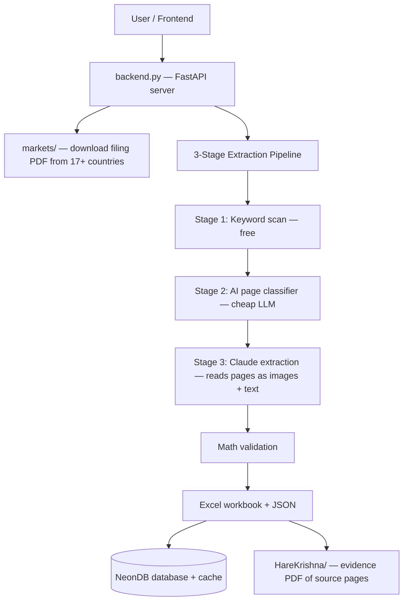
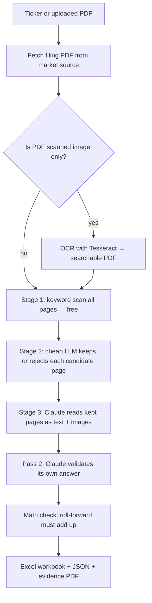
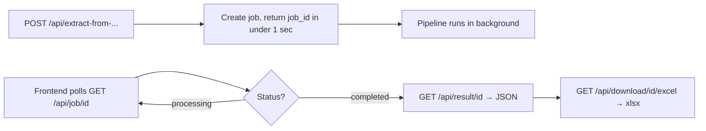
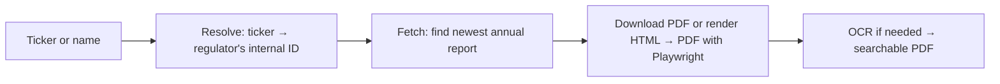
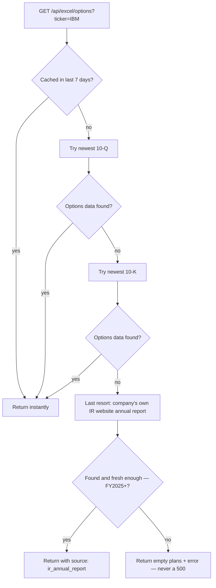
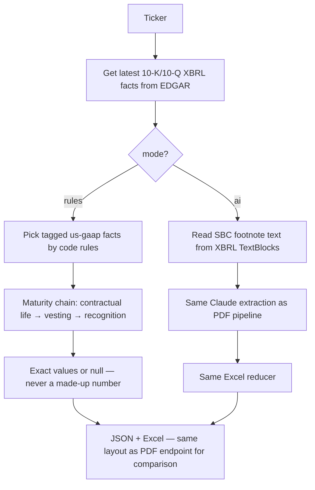
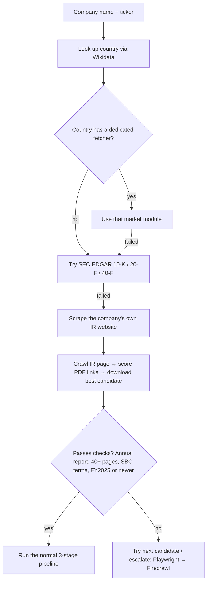
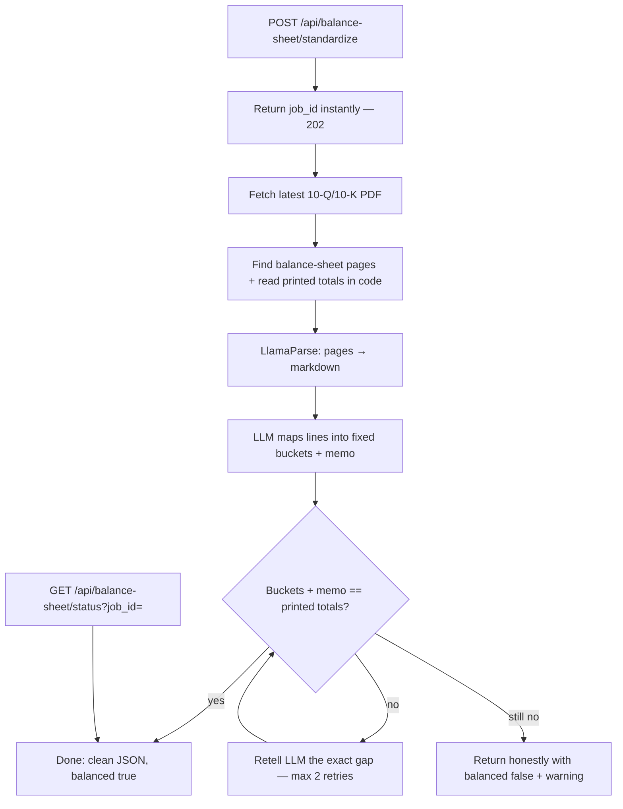
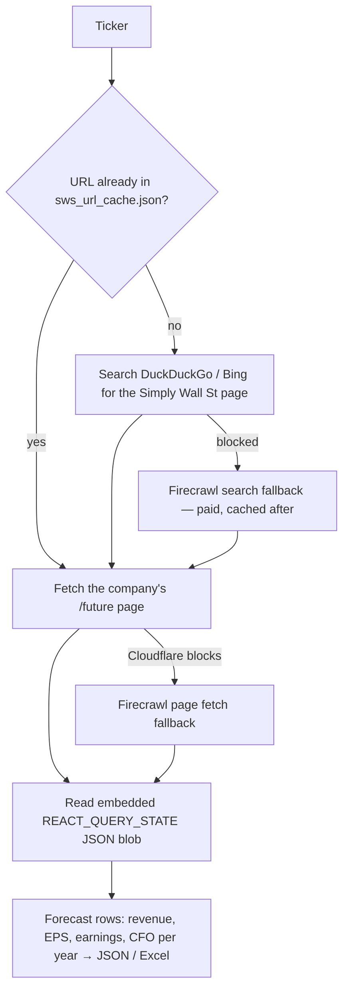
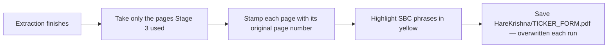

# Options Extractor — Full Code Documentation

**What this project does (one line):** You give it a company ticker. It downloads the company's official filing report, finds the stock-option (share-based compensation) pages, extracts the numbers with AI, and gives you an Excel file.

It also has extra features: a balance-sheet standardizer, an XBRL (no-PDF) extractor, an analyst-forecast scraper, and support for 17+ countries.

---

## Big Picture — How Everything Connects

**Main folders:**

| Folder / File | What it is |
|---|---|
| `backend.py` | The main server. All API endpoints + the pipeline runner. |
| `core/` | Pipeline brain — keyword scan, page classifier, prompts, caching, OCR, evidence PDFs. |
| `Anthropic/` | Claude extraction — prompts, JSON schema, the two-pass extract+validate call. |
| `markets/` | One fetcher per country (US, Japan, Korea, EU, India...). Each turns a ticker into a filing PDF. |
| `format/json_to_excel.py` | Builds the final 7-sheet Excel workbook. |
| `Balance_sheet/` | Separate feature: standardizes a company's balance sheet. |
| `Simply_wlst/` | Separate feature: scrapes analyst forecasts from Simply Wall St. |
| `USA xbrl/` | Separate feature: extracts options data straight from SEC XBRL tags (no PDF). |
| `routes/` | Extra routers: Simply Wall St, Diamond (any-company search), GuruFocus URL resolver. |
| `Frontend/` | React + Vite web app (country tabs, upload, results screens). |
| `database/` | Saves results to NeonDB (Postgres). |
| `jobs/` | Working folder — each job gets its own subfolder with the downloaded PDF and outputs. |
| `HareKrishna/` | Output folder — highlighted "evidence" PDFs showing exactly which pages the numbers came from. |

---

## Feature 1 — Main Options Extraction Pipeline

**What it does:** Takes a filing PDF and pulls out every stock-option / RSU / PSU plan (counts, exercise prices, vesting, fair values) into structured JSON, then Excel.

**Why 3 stages?** To save money. Cheap steps filter pages first, so the expensive AI only reads the few pages that matter.

- **Stage 1 — Keyword scan** (`core/options.py`, `core/keywords.py`): Free regex scan of every page. Looks for words like "RSU", "Black-Scholes", "weighted-average exercise price" (in many languages). Pages that match become candidates.
- **Stage 2 — AI page classifier** (`core/options.py`): A cheap LLM (Together AI, DeepSeek-V3) looks at each candidate page and says keep or reject. Neighbor pages of strong hits are also checked (tables can continue onto the next page).
- **Stage 3 — Claude extraction** (`Anthropic/code.py`): The kept pages are sent to Claude Sonnet as **both text and images** (so it can read tables properly). Two passes: pass 1 extracts the JSON, pass 2 double-checks it against the source.
- **Validation** (`backend.py`): Pure math check — opening + granted − exercised − forfeited must equal closing. No AI here.
- **Output**: 7-sheet Excel workbook (`format/json_to_excel.py`), JSON saved to the database, and a highlighted evidence PDF.

**Models used:** Stage 2 = DeepSeek-V3 (cheap). Stage 3 = Claude Sonnet (`claude-sonnet-4-6`, vision + text).

---

## Feature 2 — Job / Poll Pattern (how long tasks run)

**What it does:** Extraction takes minutes, so endpoints never make you wait. They return a `job_id` instantly and the work runs in the background. You poll for status.

- Jobs live in an in-memory dict (`JOBS` in `backend.py`) + a folder per job in `jobs/<id>/`.
- Status goes `queued → processing → completed / failed`, with progress % and per-stage timing.
- Results are also written to disk, so downloads still work even after a server restart.

---

## Feature 3 — Market Fetchers (17+ countries)

**What it does:** Every country has its own regulator website. Each module in `markets/` knows how to turn a ticker into that country's official annual report PDF. All of them follow the same pattern:

| Country | Source | Key facts |
|---|---|---|
| 🇺🇸 US | SEC EDGAR | 10-K / 10-Q, rendered HTML→PDF. Also appends "incorporated by reference" exhibits (the IBM fix). |
| 🇨🇦 Canada | SEC EDGAR (40-F/20-F) | SEDAR+ is bot-walled, so cross-listed issuers only. Financials live in exhibits — best one is scored and rendered. |
| 🇯🇵 Japan | EDINET (FSA) | Needs free `EDINET_API_KEY`. Scans back ~400 days for the annual securities report. |
| 🇰🇷 Korea | DART (FSS) | Needs free `DART_API_KEY` for both resolve and fetch. |
| 🇧🇷 Brazil | CVM open data | No key. DFP annual statements, extracted from a submission ZIP. |
| 🇹🇼 Taiwan | TWSE / MOPS | No key. Quarter-04 = full-year audited financial report. |
| 🇪🇺 EU/EEA | filings.xbrl.org (ESEF) | One module = ~25 countries. Renders inline-XBRL to PDF. Germany/Ireland NOT covered. |
| 🇨🇳 China | CNINFO | No key, no bot wall. Picks the real 年度报告 (skips summaries). |
| 🇮🇳 India | BSE | No key. Annual report API; OCR matters (old reports are scans). |
| 🇭🇰 Hong Kong | HKEXnews | No key. Direct PDF download of Annual Report. |
| 🇮🇩 Indonesia | IDX | Cloudflare-walled → uses Playwright. Ticker is the key directly. |
| 🇮🇱 Israel | TASE / MAYA | Listing page fetched via Firecrawl (bot wall); the PDF itself downloads free. |
| 🇬🇧 UK | Companies House | Needs `COMPANIES_HOUSE_API_KEY`. Accounts often scanned → OCR. |
| 🇩🇰 Denmark | Erhvervsstyrelsen (CVR) | No key. Handles XHTML, PDF, and old TIFF filings. |
| 🇲🇾 Malaysia | Bursa Malaysia | No key. Scores attachments to pick the audited financial statements. |
| 🇹🇭 Thailand | SEC Thailand (56-1 One Report) | No key. Goes through the regulator because the SET exchange is bot-walled. |

Bot-walled and skipped: Singapore, Saudi, SEDAR+ direct. Germany = manual upload tab.

---

## Feature 4 — Excel Options Endpoint (`GET /api/excel/options`)

**What it does:** The analyst-friendly endpoint. Give it a ticker, get back just 4 fields per plan for the valuation workbook: `count_mn` (millions), `strike`, `maturity_years`, `kind` (option/rsu).

**The smart part — for US tickers it tries three sources in order:**

- A 10-Q with no options data costs **zero** AI money (Stage 1/2 stop it before Claude runs).
- Successful results are cached 7 days by ticker (`?refresh=true` forces fresh). Failures are never cached.
- The reducer (`core/excel_options.py`) classifies each plan as option vs RSU, converts counts to millions, keeps the top 3 plans. It has a 4.0-year maturity default and a 0.1 strike floor as fallbacks.

---

## Feature 5 — XBRL Options Endpoint (`USA xbrl/`)

**What it does:** For US companies only — extracts the same options data but from the filing's **XBRL tags** (the machine-readable numbers companies must file) instead of reading the PDF. No PDF, no OCR.

Endpoint: `GET /api/xbrl/excel/options?ticker=&mode=`. Two modes:

- **`mode=rules` (default):** Pure code, no AI at all. Every number is the exact tagged value or `null`. **No defaults, no fallbacks** — "no wrong data, no old data". Maturity comes from a strict chain: remaining contractual life → vesting period → recognition period (options); vesting → recognition (RSU/PSU).
- **`mode=ai`:** Runs the exact same Claude logic as the PDF pipeline, but feeds it the footnote text from XBRL TextBlocks instead of PDF pages. Uses the same reducer (so the 4.0/0.1 fallbacks apply here).

If both 10-Q and 10-K have nothing, this endpoint also falls back to the IR-website annual report (same rule as Feature 4).

---

## Feature 6 — Diamond / IR-Website Scraper

**What it does:** The "search any company" tab. You only give a **name + ticker** — it figures out the country and finds the report itself. Also acts as the last-resort fallback for the Excel endpoints.

Order of attempts (`routes/diamond_route.py`, `prototypes/ir_fetch_proto.py`):

- **Freshness rule:** reports older than fiscal year 2025 are rejected (`MIN_FISCAL_YEAR = current year − 1`). No stale data is ever served.
- **Cost ladder:** free static crawl first → local Playwright render → paid Firecrawl stealth only as a last resort.

---

## Feature 7 — Balance Sheet Standardizer (`Balance_sheet/`)

**What it does:** Separate feature. Takes a company's latest filing, finds the balance-sheet pages, and maps every line into a fixed template (Damodaran-style buckets) — with a math check so no number can be dropped or invented.

- **Locate** (`pdf_locator.py`): finds the balance-sheet pages in the PDF by title, and reads the **printed totals** and unit label with code (not AI).
- **Parse** (`parser.py`): sends only those 1-2 pages to **LlamaParse** → markdown text.
- **Standardize** (`standardizer.py`): a Together AI LLM (Llama-3.3-70B) maps each line into fixed buckets + a **memo** section (cash, goodwill & intangibles, long-term debt kept out of the buckets).
- **Tally** (`tally.py`): pure Python — buckets + memo must equal the printed totals. If not, the LLM is retold the exact gap (up to 2 retries). If still off, the result is returned honestly with `balanced=false`. **A plug number is never invented, and numbers are never rescaled.**

There is also `POST /api/balance-sheet/excel` — the balance sheet copied **as printed** into Excel (no AI at all).

---

## Feature 8 — Simply Wall St Forecast Scraper (`Simply_wlst/`)

**What it does:** Gets forward **analyst consensus estimates** (revenue, EPS, earnings, cash flow per future year) for a ticker from simplywall.st.

Endpoints: `GET /api/simply?ticker=`, `/api/simply/grouped`, `/api/simply/excel`, and a small HTML page at `/simply`.

Free path first; Firecrawl only when datacenter IPs (Railway) get blocked. Each rescued URL is cached so it costs credits once.

---

## Feature 9 — Evidence PDFs (`HareKrishna/` + `core/evidence.py`)

**What it does:** After every options extraction, the exact source pages that produced the numbers are saved as a small PDF named `TICKER_FORM.pdf` (e.g. `IBM_10K.pdf`), with:

- a gray stamp on each page: "source: TICKER FORM — original page N"
- yellow highlights on the share-based-compensation phrases

So the analyst can verify any number against the filing in seconds. Best-effort — if it fails, the extraction is unaffected.

---

## Feature 10 — Caching (where money is saved)

| Cache | Where | Key | Lifetime |
|---|---|---|---|
| Stage 2 page classifications | `.cache/classifications/` (disk) | hash of model + prompt + page text | forever (auto-invalidates when prompt/model changes) |
| Stage 3 Claude extractions | `.cache/extractions/` (disk) | hash of prompts + schema + text + images | forever (US SEC filings deliberately bypass this — always fresh) |
| Excel endpoint results | NeonDB table `excel_options_cache` (+ disk fallback) | ticker | 7 days, `?refresh=true` overrides |
| Simply Wall St URLs | `sws_url_cache.json` | ticker | forever |

Rule everywhere: **only successes are cached — errors always retry fresh.**

---

## Feature 11 — Frontend (`Frontend/`)

React 18 + Vite + Tailwind single-page app.

- **Sidebar** — country tabs grouped by region (Americas / Europe / Asia-Pacific) + "Search any company" (Diamond) + Testing mode.
- **UploadScreen** — enter a ticker per market, or upload a PDF directly.
- **ProcessingScreen** — polls the job and shows per-stage progress.
- **ResultsScreen** — the extracted plans, with Excel/PDF download buttons.

---

## The Final Excel Workbook (`format/json_to_excel.py`)

The full extraction produces a 7-sheet workbook (only real data is shown, never empty placeholders):

1. **Executive Summary** — company, filing, plan overview
2. **Plan Roll-Forward** — opening + granted − exercised − forfeited = closing
3. **Tranche Details** — per-tranche breakdowns
4. **Valuation Inputs** — volatility, dividend yield, risk-free rate, expected term
5. **Plan Descriptions** — narrative text per plan
6. **KPIs & Ratios** — derived metrics
7. **Data Quality** — validation results and warnings

The lightweight endpoints (`/api/excel/options`, XBRL, Simply Wall St) produce their own smaller Excel files separately.

---

## API Quick Reference

| Endpoint | Method | What it does |
|---|---|---|
| `/api/extract-from-options` | POST | Main unified entry — ticker + country → full extraction |
| `/api/extract-from-<market>` | POST | One per country (edgar, japan, korea, eu, china, ...) |
| `/api/extract` | POST | Extract from an uploaded PDF |
| `/api/excel/options` | GET | 4-field plans per ticker (10-Q → 10-K → IR fallback) |
| `/api/xbrl/excel/options` | GET | Same, but from XBRL tags (`mode=rules` or `mode=ai`) |
| `/api/extract-from-xbrl` | POST | Full XBRL extraction + Excel |
| `/api/balance-sheet/standardize` | POST | Start balance-sheet job (202 + job_id) |
| `/api/balance-sheet/status` | GET | Poll balance-sheet job |
| `/api/balance-sheet/excel` | POST | Balance sheet as printed → Excel |
| `/api/simply` | GET | Analyst forecasts for a ticker |
| `/api/job/{id}` / `/api/result/{id}` | GET | Poll job / get result |
| `/api/download/{id}/excel` / `/pdf` | GET | Download outputs |
| `/api/eu-search` | GET | EU company-name autocomplete |
| `/api/fetch-filing` | POST | Just download the latest filing PDF (no extraction) |
| `/api/health` | GET | Server alive + active job count |
